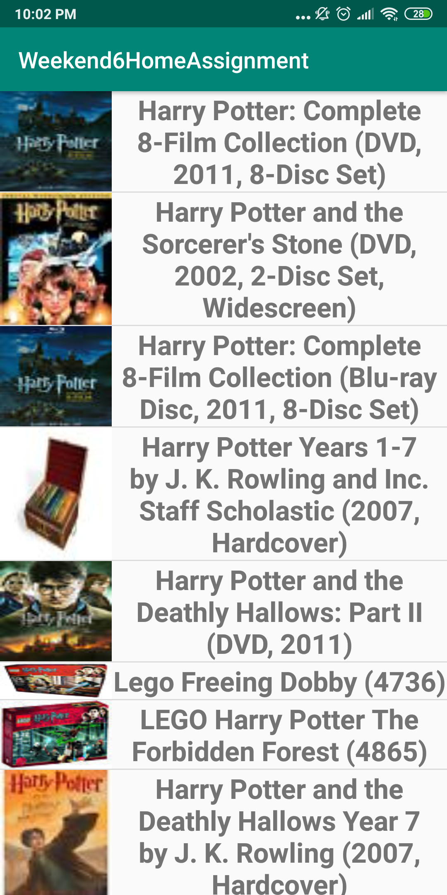
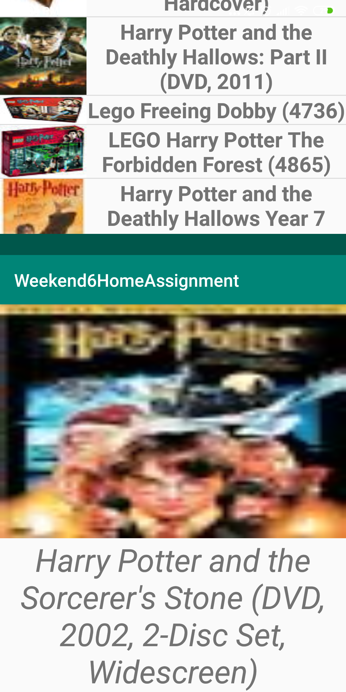
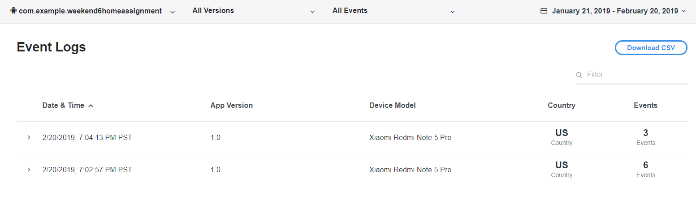

# Weekend6HomeAssignment
A simple android app which shows data from api in recyclerview and clicking one item will show more details. MVVM is followed. Analytics has been integrated. Junit testing and Instrumented testing has been given.

List of books showing.

Selecting a book showing details.

Up/Down transition when navigating.

Analytics in Flurry.

